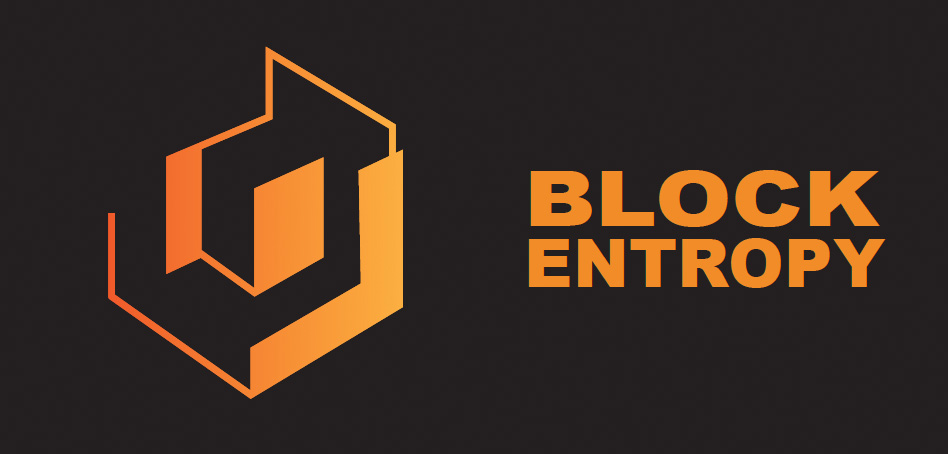

# Burn-Faucet

The Block Entropy TestNet Faucet is a front end application that allows anyone to obtain LUNC on the Entropy TestNet.

**WARNING**: Tokens recieved over the faucet are not real assets and have no market value.

## Get tokens on Block Entropy TestNet

The only way to obtain tokens on the testnet is through burning LUNC on columbus-5.

1. Burn LUNC on Columbus-5.  Send LUNC to the burn address, terra1sk06e3dyexuq4shw77y3dsv480xv42mq73anxu
2. Obtain the tx hash of the transaction.  Copy and Paste the tx hash into this burn faucet.
3. The equivalent amount of LUNC on testnet will be sent to the wallet that burned LUNC on main net.

## Purpose of the Burn Faucet

The purpose of this burn faucet is to faciliate the burning of tokens on Columbus-5 mainnet.  The tokens obtained on testnet 
can be used for Machine Learning tasks on the testnet only.  These tokens on testnet have no value.  Once you burned your tokens
on mainnet, they are gone.  There is no way to swap testnet tokens back to mainnet.  

After the establishment of Interchain Accounts, this TestNet will be turned off and the focus will switch from Burn to Utility.
